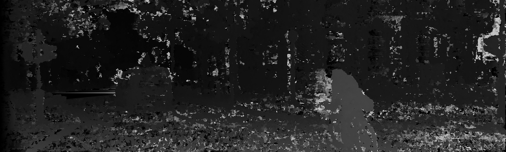
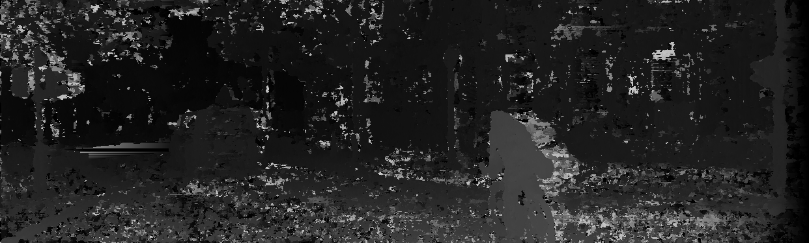
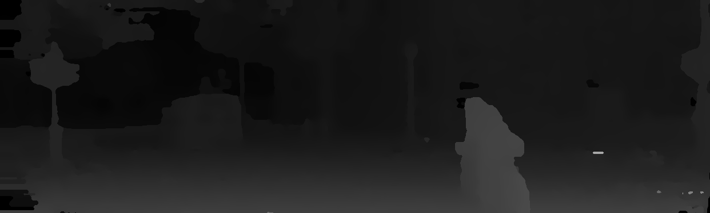

# Efficient Deep Learning for Stereo Matching Tensorflow 2

This is a Tensorflow 2.x version re-implementation of Luo, W., & Schwing, A. G. (n.d.). Efficient Deep Learning for Stereo Matching.
(https://www.cs.toronto.edu/~urtasun/publications/luo_etal_cvpr16.pdf)

### Setup data folders

```
kitti2015
    │─── training
         |───image_2
             |───000000_10.png
             |───000001_10.png
             |─── ...
         |───image_3
         |───disp_noc_0
         |─── ...
    │─── testing
         |───image_2
         |───image_3
```

## Preprocess data

Modify variable data_root in preprocess/kitti2015_gene_loc_1.m with the path to corresponding training folder.
Go to preprocess folder and use matlab to run: kitti2015_gene_loc_1(160,40,18,100,'debug_15',123) to generate three binary files(~300MB total), corresponding to pixel locations you want to train and validate on.

Parameters: 160 is number of images to train on, 40 is number of image to validate on, 18 represents size of image patch with (2x18+1) by (2x18+1), 100 represents searching range(disparity range to train on, corresponding to 2x100+1), 'debug_15' is the folder to save results, 123 is the random seed.

1. Matlab or Octave needs to be installed
2. Replace path to dataset in preprocess/preprocess.m
3. cd preprocess
4. octave preprocess.m

## Steps
1. Folder preprocess
 
    Crate patches dataset by running matlab preprocess.m 
    kitti2015_gene_loc_1(160,40,4,100,'debug_15_ws_9',123, '../kitti2015/training')
    Parameters: 160 is number of images to train on, 40 is number of image to validate on, 4 represents size of image patch with (2x4+1) by (2x4+1), 100 represents searching range(disparity range to train on, corresponding to 2x100+1), 'debug_15' is the folder to save results, 123 is the random seed.
    patch_size: 9x9, disparity range: 201
    Dataset .bin saved in debug_15_ws_9 folder
    
2. train.py
 
    There are two models in models folder: base_model (patch size 37x37), base_model_ws_9(patch size 9x9)
    Checkpoint saved in new_checkpoint
 
3. evaluate.py

    Calculate error between label i and predict disparity range of pixel i 
    
4. inference.py
 
    Create disparity map and calculate error between prediction disparity map and ground truth disparity map (before postprocessing) that saved in results (gt, left_cost, right_cost, left_disp, right_disp)
    gt: ground truth of disparity map
    left_cost: left cost volume (.bin)
    right_cost: right cost volume (.bin)
    left_disp: predicted left disparity map
    right_disp: predicted right disparity map
    
    In my process, I got the error pixel is 12.47
 
5. Postprocessing (post.lua), you need to install torch7 and mc-cnn (go to smooth folder)
    Cost aggregation -> SGM -> Cost aggregation 2 -> occlusion -> subpixel -> median -> bilateral
    
    equal to (in results folder):
    
    nyu_cost_img -> nyu_sgm_img -> nyu_cost_img_2 -> (nyu_post, outlier)
    
    Finally, nyp_post folder is last step in postprocessing disparity map
    
6. cal.py 
    Re calculate pixel error after postprocessing
    
    I got the error pixel is 0.03322434828603092


## Results
Before post-processing

Left:

Right:


After post-processing


#### Quantitative results

* To compare with results reported in paper, look at Table-5, column `Ours(9)`.


  |                                     | 3-pixel error (%)   |
  |-------------------------------------|:-------------------:|
  | baseline (paper)                    |     15.25            |
  | baseline (re-implementation)        |     12.47           |
  | baseline + CA + SGM + Post (paper)               |     4.25            |
  | baseline + CA + SGM + Post (re-implementation)   |     3.32            |
